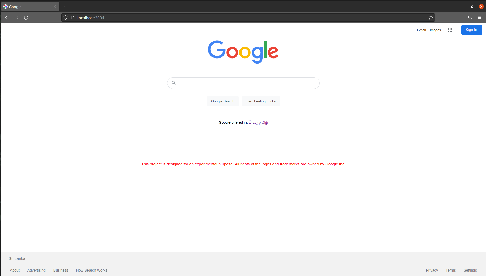
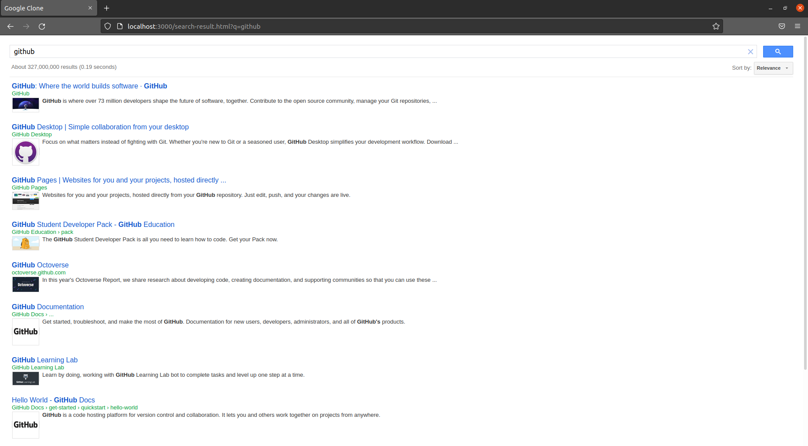

# Google Custom Search Engine - V 0.1.0

### IMP - This project is designed for an experimental purpose. All the rights of trademarks and logos are owned by Google Inc.

## Introduction
This repository represents the custom search engine that I have developed using the universal programming languages. This custom search engine is a software that allows users to browse the internet. 
The source code is available to everyone under the standard [MIT License](https://choosealicense.com/licenses/mit/).

## License
Copyright © 2022 -  B G Thakshila Nuwangi. All rights reserved.

Licensed under the [MIT License](https://choosealicense.com/licenses/mit/)

